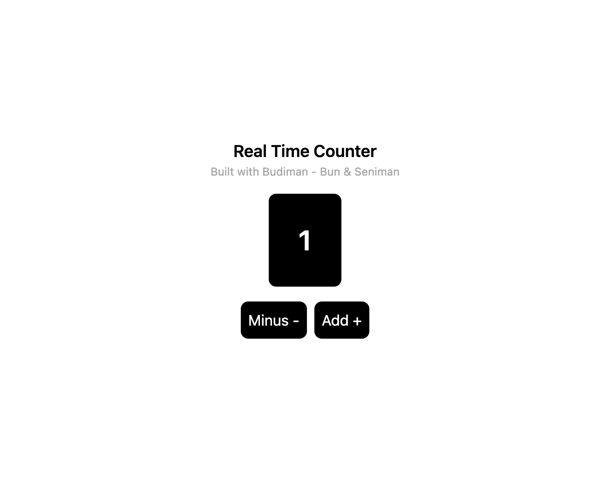

# budiman

Bun that runs Seniman



To install dependencies:

```bash
bun install
```

To build server:

```bash
bun run build
```

To build style:

```bash
bun run style
```

To run server:

```bash
bun start
```

This project was created using `bun init` in bun v1.0.14. [Bun](https://bun.sh) is a fast all-in-one JavaScript runtime.
